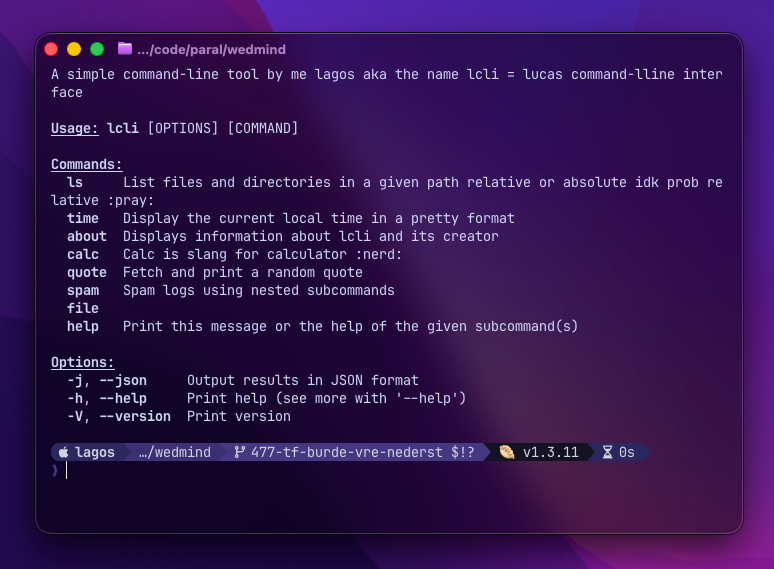

# lcli

[](https://opensource.org/licenses/MIT)
[](https://github.com/lhagfoss/lcli/releases)
[](https://github.com/lhagfoss/lcli/actions)

A command-line tool built with Rust made by awesome sauce lagos (me).



## Installation

*coming soon...*
For now git clone the repo then do the next step.

```bash
cargo install --path .
```

This will put the `lcli` binary in your `~/.cargo/bin` folder, which should already be in your `$PATH`.

## Usage

### List Files and Directories
```bash
lcli ls                    # List files in current directory
lcli ls /path/to/dir      # List files in a specific directory
```

### Display Current Time
```bash
lcli time                  # Show the current local time in pretty format
```

### About
```bash
lcli about                 # Display information about lcli and its creator
```

### Calculator
```bash
lcli calc add 5 3          # Add two numbers (5 + 3)
lcli calc subtract 10 4    # Subtract two numbers (10 - 4)
lcli calc multiply 6 7     # Multiply two numbers (6 * 7)
lcli calc divide 20 4      # Divide two numbers (20 / 4)
```

### Quotes
```bash
lcli quote random          # Fetch and print a random quote
lcli quote create "Be yourself" "Oscar Wilde"  # Create a custom quote
```

### Spam Logging
```bash
lcli spam counter "Hello" 5        # Print "Hello" 5 times
lcli spam duration "Processing" 3  # Print "Processing" for 3 seconds
```

### File Operations
```bash
lcli file new myfile.txt                       # Create a new file in current directory
lcli file new myfile.txt /path/to/dir         # Create a new file in a specific directory
lcli file delete /path/to/file.txt            # Delete a file
lcli file move /path/to/old.txt /path/to/new.txt    # Move a file
lcli file rename /path/to/old.txt /path/to/newname.txt  # Rename a file
```

### JSON Output
```bash
lcli ls --json                  # Get ls output in JSON format
lcli time --json                # Get time output in JSON format
lcli quote random --json        # Get quote output in JSON format
```

## Development

Built with:
- `clap` for the CLI interface.
- `owo-colors` for beautiful terminal output.
- `tabled` for pretty-printing data.
